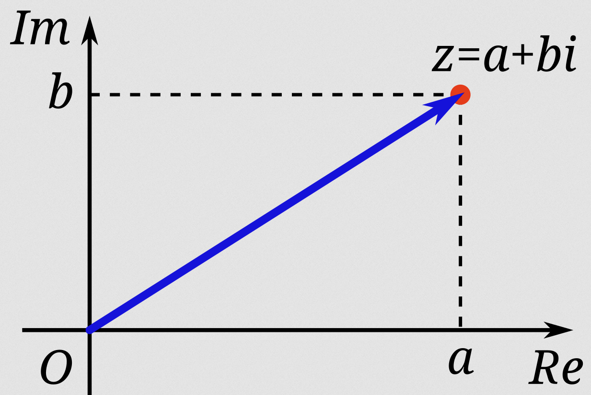
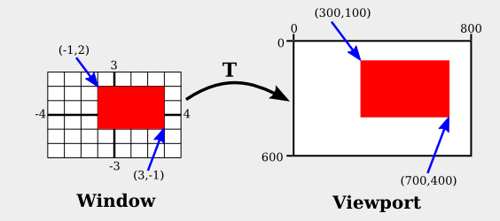
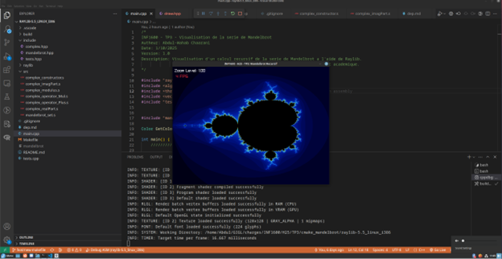

# INF1600 - H25 - TP3

Lien entre C++ et assembleur x86.
Appels de fonction et récursivité.

# Table des matières

- [INF1600 - H25 - TP3](#inf1600---h25---tp3)
- [Table des matières](#table-des-matières)
  - [1 Introduction et sommaire](#1-introduction-et-sommaire)
    - [1.1 Remise](#11-remise)
  - [Date de remise : Dimanche 16 mars 23h59](#date-de-remise--dimanche-16-mars-23h59)
    - [1.2 Barème](#12-barème)
    - [1.3 Prérequis](#13-prérequis)
      - [1.3.1 Installer les dépendances](#131-installer-les-dépendances)
      - [1.3.2 Installer les extensions C/C++ recommendées](#132-installer-les-extensions-cc-recommendées)
    - [1.4 Compilation et exécution](#14-compilation-et-exécution)
  - [2 Visualisation de l’ensemble de Mandelbrot](#2-visualisation-de-lensemble-de-mandelbrot)
    - [2.1 L’ensemble de Mandelbrot](#21-lensemble-de-mandelbrot)
    - [2.2 Nombres complexes](#22-nombres-complexes)
    - [2.3 Notion d’infographie](#23-notion-dinfographie)
  - [3 TLDR](#3-tldr)
  - [4 TODO](#4-todo)
  - [5 Classe Complex](#5-classe-complex)
  - [5.1 Complex()](#51-complex)
  - [5.2 realPart()](#52-realpart)
  - [5.3 imagPart()](#53-imagpart)
  - [5.4 operator+()](#54-operator)
  - [5.5 operator\*()](#55-operator)
  - [5.6 modulus()](#56-modulus)
  - [6 Fonction récursive de Mandelbrot()](#6-fonction-récursive-de-mandelbrot)
  - [7 main()](#7-main)
  - [8 Résultat final](#8-résultat-final)
    - [Bon travail!](#bon-travail)

## 1 Introduction et sommaire

Ce travail pratique vise à explorer les relations entre le langage C++ et l’assembleur. Vous serez amené à étudier la taille occupée en mémoire par les classes et l’impact de l’alignement sur cette taille. Par ailleurs, vous analyserez le mécanisme permettant à C++ de gérer plusieurs fonctions portant le même nom (name mangling). Vous examinerez également l’effet des appels de fonctions récursives sur le fonctionnement du programme. Enfin, vous devrez mobiliser l’ensemble de vos connaissances en assembleur x86 IA-32 pour déchiffrer un code écrit en C++.

### 1.1 Remise

Voici les détails concernant la remise de ce travail pratique :

- Méthode : sur Moodle, une seule remise par équipe. Seules des équipes de deux (2) étu-diants sont tolérées, sauf avis contraire.
- Format: un dossier compressé, incluant les sources de vos programmes en C++ et en assem-bleur
- Fichier attendu, il suffit de faire make zip pour générer le répertoire suivant qui est à dépo-ser su Moodle.
  INF1600_H25_TP3_REMISE.zip
- Fichiers à remplir :

```
INF1600_TP3
└── /src_TODO
    ├── complex_constructor.s
    ├── complex_modulus.s
    ├── complex_operator_Mul.s
    ├── complex_operator_Plus.s
    └── mandelbrot_set.s
```

- Contrainte : Il est INTERDIT d’utiliser la librairie std ::complex. Il faut le coder soi-même!

## Date de remise : Dimanche 16 mars 23h59

### 1.2 Barème

| Fichier                 | Note |
| ----------------------- | ---- |
| complex_constructor.s   | / 10 |
| complex_operator_Plus.s | / 10 |
| complex_operator_Mul.s  | / 15 |
| complex_modulus.s       | / 15 |
| mandelbrot_set.s        | / 50 |
| Total                   | /100 |

### 1.3 Prérequis

Ce TP fait le lien entre le C++. On utilise aussi la librairie graphique Raylib. Nous avons donc besoin d’un compilateur C++ 32 bits et des dépendances en lien avec OpenGL et le système de fenêtrage X11. Ces dernièeres doit supporter la compilation en 32 bits qui est utilisée dans le cadre du cours.

#### 1.3.1 [Installer les dépendances](dep.md)

#### 1.3.2 Installer les extensions C/C++ recommendées

### 1.4 Compilation et exécution

**En ligne de commande** :
<br>
`make` pour compiler
<br>
`make run` (ou `./mandelbrot`) pour exécuter
<br>
**Avec les outils VsCode** :
<br>
`F5` pour compiler et déboguer
<br>
`Shift + F5` pour compiler et exécuter sans débogage

## 2 Visualisation de l’ensemble de Mandelbrot

### 2.1 L’ensemble de Mandelbrot

Une fractale est un objet géométrique dont la structure se répète à différentes échelles, et ce, de façon infinie. C’est donc un exemple parfait de fonction récursive qui existe naturellement dans le domaine mathématique. Notre objectif : le générer avec du code!
L’ensemble de Mandelbrot (figure 1) est une fractale définie par récurrence comme suit

```
z_{n+1} = z_n^2 + c
```

où C et z sont des nombres complexe.


Figure 1 : Visualisation de l’ensemble de Mandelbrot

Un nombre complexe est dans l’ensemble lorsque la suite zn est bornée en module. En d’autres mots, lorsqu’on itère sur cette suite et que le module résultant ne tend pas vers l’infini, le nombre complexe est dans l’ensemble.

```
z_0 = C
z_1 = z_0^2 + C
z_2 = z_1^2 + C
z_3 = z_2^2 + C
```

On peut donc compter le nombre d’itération que ça prend avant que la suite diverge. Pour que ça ne prenne pas un temps infini, on va se limiter à un maximum de 100 itérations. Il suffit donc d’associer une couleur au nombre d’itération et on peut faire apparaître l’image de la figure 1!

### 2.2 Nombres complexes

Un nombre complexe est défini sous la forme x+iy où i est le nombre imaginaire tel que i2 = −1



Ce n’est pas le but de ce TP de maîtriser les nombres complexes. Il faut simplement comprendre qu’on peut utiliser un plan cartésien en 2D pour les représenter. En résumé, la partie réelle est associée à l’axe des x, alors que la partie imaginaire est associée à l’axe des y. Il est donc possible de représenter les points de l’ensemble de Mandelbrot sur un graphe.

### 2.3 Notion d’infographie



Afin de faire apparaître la fractale, nous allons itérer sur une série de coordonnées. Ces coordonnées proviennent de notre écran. En effet, un tableau 2D de coordonnées peut se traduire en un tableau 2D de pixels. Nous utiliserons la librairie Raylib pour l’affichage.

## 3 TLDR

Bref, nous allons itérer sur un tableau 2D de coordonnées x, y où chaque coordonnée est un pixel. Ensuite, nous allons transformer ses coordonnées en nombre complexe tel que x est la partie réelle et y est la partie imaginaire. Nous allons ensuite vérifier si ce nombre complexe vérifie la relation récursive de Mandelbrot. Ceci nous permettra d’afficher la fractale !

Les nombres complexes s’additionnent, se multiplient et ont un module. Bien sûr, ces opérations se calculent différemment que les nombres réels. Afin de faciliter les opérations sur les nombres complexes, nous allons créer notre propre classe Complex. Ensuite, nous allons créer notre propre fonction récursive de Mandlebrot.

What’s the catch? Le tout doit être en assembleur! Votre objectif est donc de traduire les fonctions et méthodes suivantes en assembleur.

## 4 TODO

Nous allons donc nous créer notre propre classe Complex et surcharger les opérateurs d’addition et multiplication. Nous allons aussi créer notre méthode qui calcule le module d’un nombre complexe. Enfin, nous allons coder la définition de l’ensemble de Mandelbrot sous la forme d’une fonction récursive.

Attention! Il faut éviter la duplication de code! Rappelez vous qu’on peut faire des appels de fonction C++ en assembleur en utilisant le mangling de la fonction.

Certaines instructions de la FPU sont nécessaires. **Lisez bien les commentaires de chaque méthode dans leur fichier respectif car on vous guide sur leur utilisation.**

Selon votre ordinateur, il est très possible que l’affichage soit lent car notre calcul consommera beaucoup de ressources. Aucun point ne sera retiré en raison de l’affichage.

**Vous devez compléter les fichiers assembleur (.s) dans le répertoire INF1600_TP3 > src_TODO**

## 5 Classe Complex

La définition de la classe Complex se trouve dans `INF1600_TP3 > include > complex.hpp`
Pour vous guider, vous trouverez également une implémentation en C++ dans
`INF1600_TP3 > src_reference_cpp > complex.cpp`

Voici la déclaration de la classe Complex

```cpp
class Complex {
    float real; // partie réelle     (x)
    float imag; // partie imaginaire (y)

   public:
    Complex(float x, float y);
    float realPart() const; // accesseur de la partie réelle
    float imagPart() const; // accesseur de la partie imaginaire
    float modulus() const;  // retourne le module du nombre complexe
};

Complex operator+(const Complex& c1, const Complex& c2);
Complex operator*(const Complex& c1, const Complex& c2);
```

**Voici une description ainsi que l’ordre suggéré de complétion des méthodes**

## 5.1 Complex()

 [`INF1600_TP3 > src_TODO > complex_constructor.s`](/src_TODO/complex_constructor.s)
<br>
 Constructeur de la classe Complex. Il initialise les attributs real et imag par les arguments x et y fournis en paramètre.

```cpp
Complex::Complex(float x, float y) : real(x), imag(y) {}
```

## 5.2 realPart()

 [`INF1600_TP3 > src_TODO > complex_realPart.s`](/src_TODO/complex_realPart.s)
<br>
 Cette méthode vous est déjà fournie. Elle retourne la partie réelle du nombre complexe.

```cpp
float Complex::realPart() const { return real; }
```

## 5.3 imagPart()

 [`INF1600_TP3 > src_TODO > complex_imagPart.s`](/src_TODO/complex_imagPart.s)
<br>
 Cette méthode vous est déjà fournie. Elle retourne la partie imaginaire du nombre complexe.

```cpp
float Complex::imagPart() const { return imag; }
```

## 5.4 operator+()

 [`INF1600_TP3 > src_TODO > complex_operator_Plus.s`](/src_TODO/complex_operator_Plus.s)
<br>
 La surcharge de l’opérateur + pour additionner 2 nombres complexes avec la formule :
(a + ib) + (c + id) = (a + c) + i(b + d)
L'opérateur plus doit appeler un constructeur pour créer le nombre complexe résultat de l'addition (retour de la fonction).

```cpp
Complex operator+(const Complex& c1, const Complex& c2) {
    return Complex(c1.realPart() + c2.realPart(), c1.imagPart() + c2.imagPart());
}
```

## 5.5 operator\*()

 [`INF1600_TP3 > src_TODO > complex_operator_Mul.s`](/src_TODO/complex_operator_Mul.s)
<br>
 La surcharge de l’opérateur \* pour multiplier 2 nombres complexes avec la formule :
(a + ib) (c + id) = (ac - bd) + i(ad + bc)
L'opérateur mul doit appeler un constructeur pour créer le nombre complexe résultat de la multiplication (retour de la fonction).

```cpp
Complex operator*(const Complex& c1, const Complex& c2) {
    	return Complex(c1.realPart() * c2.realPart() - c1.imagPart() * c2.imagPart(),
                       c1.realPart() * c2.imagPart() + c1.imagPart() * c2.realPart());
       }
```

## 5.6 modulus()

 [`INF1600_TP3 > src_TODO > complex_modulus.s`](/src_TODO/complex_modulus.s)
<br>
 Retourne le module du nombre complexe avec la formule suivante : √(x^2+y^2 )

```cpp
float Complex::modulus() const {
    	return std::sqrt(realPart() * realPart() + imagPart() * imagPart());
     } 
```

## 6 Fonction récursive de Mandelbrot()

 [`INF1600_TP3 > src_TODO > mandelbrot_set.s`](/src_TODO/mandelbrot_set.s)
<br>
 La fonction récursive de Mandelbrot

```cpp
const int maxIterations = 100;
const float escapeRadius = 2.0;

int mandelbrotSet(const Complex& z, const Complex& c, int count) {
    if (z.modulus() >= escapeRadius) return count;  // cas de base 1
    if (count + 1 > maxIterations) return count;    // cas de base 2
    return mandelbrotSet(z * z + c, c, ++count);    // cas recursif
}

```

## 7 main()

 [`INF1600_TP3 > main.cpp](main.cpp)
<br>
 La fonction récursive de Mandelbrot

Le fichier main.cpp se divise en 4 parties :

- Partie 0 : Compilation. Une fonction pour tester la compilation. Si le projet de départ compile, il faut commenter l’appel à drawInit() pour commencer le TP.
- Partie 1 : Vide. Un espace vide est laissé pour vous aider à tester vos fonctions avec vos propres appels.
- Partie 2 : Tests. La fonction runTests() roule une série de tests pour chaque fonction à coder. Le résultat des tests s’affichera dans le terminal.
- Partie 3 : Affichage. La fonction drawMandelbrot() vous permettra de faire afficher la visualation de Mandelbrot que vous avez codé. Il est recommandé de faire passer tous les tests avant de décommenter la fonction. Rappel : l’affichage n’est pas une condition nécessaire à la réussite du TP.

## 8 Résultat final

L’ensemble de Mandelbrot généré de façon programmatique!



### Bon travail!
